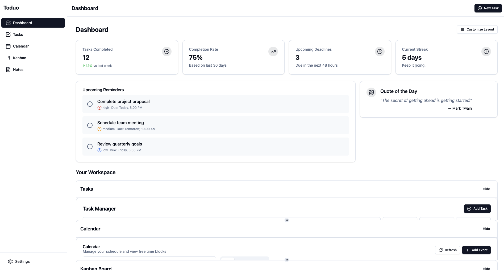

# Toduo

**The task management app that works the way your brain does.** Toduo combines the best of todo lists and task management with a sleek, intuitive interface that helps you get things done - not just organize them.
Toduo connects to the applications you use for work and in your personal life to help you sift through all the noise. It uses AI to understand and generate action items, insight about your work, and prioritize what you need to get done. It's like an assistant who is everywhere you are. 

We think of it like this: **tasks should find you, not the other way around** - Instead of manually creating tasks from emails or messages, our technology automatically identifies and extracts them for you, saving you time and mental energy.

---
Toduo is a full-stack, cross-platform task management application with local-first storage and optional cloud sync. IBuilt with modern web frameworks and available as both a web app and desktop application. Even better, it's open source. 



## Features

- ✅ **Local-first architecture** - Your data stays on your device, even offline
- 🔄 **Optional cloud sync** with Supabase
- 🖥️ **Cross-platform** - Available as web app and desktop app (via Electron)
- 🎨 **Modern UI** built with React, TypeScript, and Tailwind CSS
- 🔒 **Secure** - Your data belongs to you
- 💪  **Turning information overload into actionable tasks** - We use smart technology to scan through all the places where your work lives—emails, meetings, chats—and automatically create organized to-do lists so nothing falls through the cracks.

## Getting Started

### Prerequisites

- Node.js (v18 or higher)
- npm or yarn

### Installation

1. Clone the repository
   ```bash
   git clone https://github.com/yourusername/toduo.git
   cd toduo
   ```

2. Install dependencies
   ```bash
   npm install
   ```

3. Set up environment variables
   ```bash
   cp .env.example .env.local
   ```
   Edit `.env.local` and add your Supabase credentials if you're using cloud sync.

4. Start the development server
   ```bash
   npm run dev
   ```
   
5. For Electron development
   ```bash
   npm run electron:dev
   ```

### Building for Production

#### Web App
```bash
npm run build
```

#### Desktop App
```bash
npm run electron:build
```

## Architecture

Toduo follows a modern architecture pattern designed for performance, flexibility, and developer experience.

### Tech Stack

- **Frontend**: React, TypeScript, Tailwind CSS
- **UI Components**: Radix UI, shadcn/ui
- **State Management**: React Context API, React Query
- **Database**: 
  - Local: SQLite via better-sqlite3
  - Cloud: Supabase (PostgreSQL)
- **Desktop App**: Electron
- **API Server**: Express.js (for optional features)

### Project Structure

```
toduo/
├── src/                  # Main web application source
│   ├── components/       # Reusable UI components
│   ├── contexts/         # React contexts for state management
│   ├── db/               # Database interfaces
│   ├── hooks/            # Custom React hooks
│   ├── lib/              # Utility functions and shared code
│   ├── services/         # API and service integrations
│   └── types/            # TypeScript type definitions
├── electron/             # Electron main process code
├── server/               # Optional backend server code
└── public/               # Static assets
```

### Data Flow

1. **Local Storage**: User data is first written to the local SQLite database
2. **Sync Engine**: If enabled, changes are synchronized with Supabase
3. **Offline Support**: All core functionality works without an internet connection

### Build Pipeline

The application uses Vite for fast development and optimized builds, with TypeScript for type safety throughout the codebase.

## Roadmap / Todos

- [ ] **Task Organization**
  - [ ] Implement drag-and-drop for task reordering
  - [ ] Add support for nested tasks and subtasks
  - [ ] Create custom lists/categories for better organization

- [ ] **UI/UX Improvements**
  - [ ] Add dark/light theme toggle
  - [ ] Implement keyboard shortcuts for power users
  - [ ] Design mobile-responsive layouts for all screen sizes

- [ ] **Data & Sync**
  - [ ] Improve offline conflict resolution for cloud sync
  - [ ] Add data export/import functionality
  - [ ] Implement end-to-end encryption for cloud data

- [ ] **Collaboration Features**
  - [ ] Add shared lists with permission controls
  - [ ] Implement real-time collaborative editing
  - [ ] Create notification system for shared task updates

- [ ] **Integrations**
  - [ ] Calendar integration (Google Calendar, Apple Calendar)
  - [ ] Email integration for task creation via email
  - [ ] API for third-party integrations

- [ ] **Performance**
  - [ ] Optimize database queries for faster loading
  - [ ] Implement lazy loading for large task lists
  - [ ] Reduce Electron app memory footprint

## Contributing

Contributions are welcome! Please feel free to submit a Pull Request.

## License
I dunno man, just give me money if you make money off this somehow. Give lots of money. I'm tired of my day job
